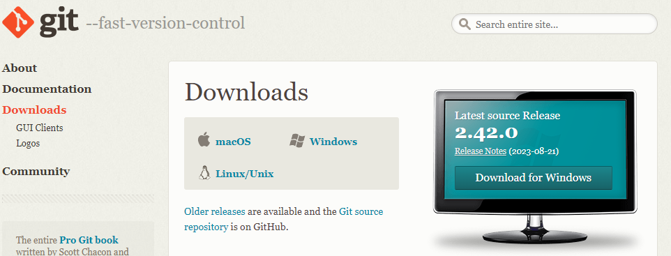

# Установка Git
Официальная сборка доступна для скачивания на официальном сайте Git
Откроется установщик, следует выполнять указанные инструкции
**Как задать имя пользователя и адрес электронной почты**    
Имя пользователя нужно, чтобы привязывать коммиты к имени  
git config --global user.name "den"

Кроме того, командой git config можно изменять адрес электронной почты, привязанный к вашим коммитам Git. Новый адрес электронной почты будет автоматически отображаться во всех дальнейших коммитах, поданных на GitHub через командную строку.

git config --global user.email "den@pochta.ru"

Просмотреть статус нужного репозитория можно по ключевому слову status: его действие распространяется на подготовленные, неподготовленные и неотслеживаемые файлы.
Добавить отдельный файл в область подготовленных файлов можно параметром add с указанием имени файла.   

## Каждый из файлов в любом текущем рабочем репозитории Git относится к одному из трех типов:
**Отслеживаемые** – это все файлы и каталоги, о которых знает Git. Это файлы и каталоги, которые были недавно размещены (добавлены с помощью git add) и зафиксированы (закоммичены с помощью git commit) в главном репозитории.  
**Неотслеживаемые** – это новые файлы и каталоги, которые созданы в рабочем каталоге, но еще не размещены (или добавлены с помощью команды git add).  
**Игнорируемые**– это все файлы и каталоги, которые полностью исключаются и игнорируются, и никто о них в репозитории Git не знает. По сути, это способ сообщить Git о том, какие неотслеживаемые файлы так и должны остаться неотслеживаемыми и не должны фиксироваться.    
--
Все файлы, которые должны быть проигнорированы, сохраняются в файле .gitignore.
Файл .gitignore – это обычный текстовый файл, который содержит список всех указанных файлов и папок проекта, которые Git должен игнорировать и не отслеживать.  
--
**Создать пустой репозиторий Git** -git init  
**Внесение изменений:**
git commit -m "message"  
**Просмотр** истории коммитов с изменениями:
git log    
**Удалять** файлы из текущего рабочего дерева можно с помощью параметра rm. При этом файлы удаляются и из индекса.  
**Восстановить** файлы рабочего дерева, не подготовленные к коммиту, можно параметром checkout. Для проведения операции требуется указать путь к файлу.
Внести изменения в последний коммит можно параметром commit с флагом --amend. Например, вы записали изменения, внесённые в ряд файлов, и поняли, что допустили ошибку в сообщении коммита  
**Откат последнего коммита** 
Откатить последний коммит можно с помощью параметра **revert**. Создастся новый коммит, содержащий обратные преобразования относительно предыдущего, и добавится к истории текущей ветки.  
**Разница между revert и reset**  
Команда *git revert* отменяет изменения, записанные только одним коммитом. Она не откатывает проект к более раннему состоянию, удаляя все последующие коммиты, как это делает команда *git reset*.  
**Создать** новую ветку можно с помощью параметра branch, указав имя ветки.  
*git branch new_branch_name*  
Можно **просматривать** полный список веток, используя параметр branch. Команда отобразит все ветки, отметит текущую звёздочкой (*) и выделит её цветом.  
*git branch*  
**Объединить** две ветки можно параметром merge с указанием имени ветки. Команда объединит указанную ветку с основной.  
git merge existing_branch_name  
**Просмотр заданного коммита**  
Просмотреть полный список изменений, внесённых конкретным коммитом, можно с помощью параметра show, указав идентификатор или хеш коммита  
**Отправка изменений в удалённый репозиторий**  
Отправлять изменения в удалённый репозиторий можно параметром push с указанием имени репозитория и ветки.

# Команды
| Команда     | Значение              
| ------------- |:------------------:| 
| git config --global user.name     | Установка имени   
| git config --global user.email     | Установка почты
| git init  | Инициализация репозитория   
| git add  | Добавление отдельных файлов в область подготовленных файлов
| git status  | Проверка статуса репозитория
| git commit -m "message"     | Внесение изменений с однеострочным сообщением
| git log | Просмотр истории коммитов   
| git diff | Просмотр изменений до коммита 
|git rm   | даление отслеживаемых файлов из текущего рабочего дерева
|git branch|cоздание новой ветки|
|git show| Просмотр заданного коммита 
|git merge   | Объединить две ветки
|git push|отправка изменений в удаленный репозиторий|
